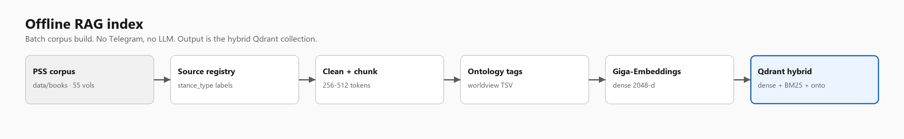
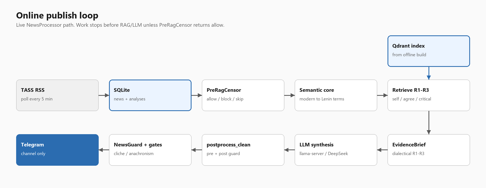
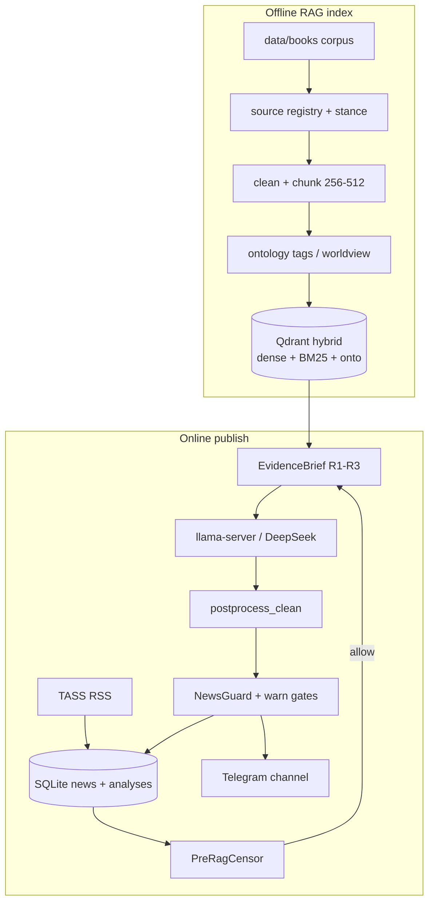
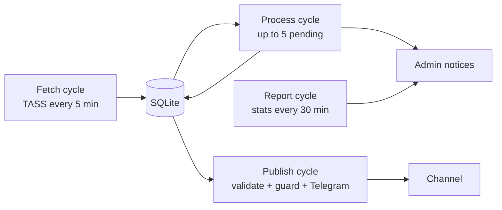
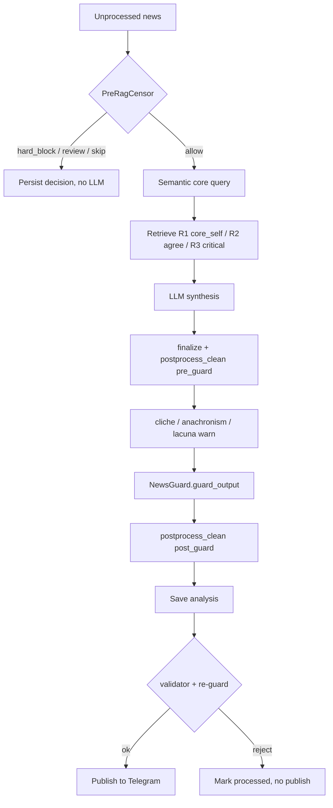

# AI_Lenin

Local news-RAG pipeline (Telegram): fetch news → PreRagCensor → retrieve (Qdrant hybrid) → optional dialectical R1–R3 EvidenceBrief → LLM analysis → postprocess_clean → NewsGuard + anti-cliché / anti-anachronism / lacuna-hedge warn gates.

## Hot path

```text
news → PreRagCensor (allow / hard_block / review / skip)
    → context / EvidenceBrief (R1–R3 when dialectical_orchestration.enabled)
    → generate → finalize_generated_text
    → quality postcheck (quotes / loops / postprocess_clean pre_guard)
    → mark_unverified_facts
    → cliche_gate (non-mutating) → anachronism_gate (non-mutating)
    → lacuna_hedge_gate (non-mutating, when semantic_core enabled)
    → NewsGuard.guard_output → postprocess_clean post_guard
    → persist/publish re-guard + terminal public scrub → Telegram
```

Answer scrub SoT: [`docs/answer_postprocess.md`](docs/answer_postprocess.md).  
CLI layout: [`scripts/README.md`](scripts/README.md) (canonical `scripts/<domain>/`; root `scripts/*.py` are shims).

Stance layers in Qdrant payload `stance_type`:

| Slot | stance_type | Role |
|------|-------------|------|
| R1 | `core_self` | Lenin / PSS |
| R2 | `influence_agree` | supports / agreements |
| R3 | `influence_critical` | opposition / critique |

Details: [`docs/dialectical_orchestration_r1_r3.md`](docs/dialectical_orchestration_r1_r3.md). Priorities: [`docs/priority_crisis_recovery_and_hardening.md`](docs/priority_crisis_recovery_and_hardening.md). Docs index: [`docs/README.md`](docs/README.md). Agent conventions: [`AGENTS.md`](AGENTS.md).

## Architecture

Offline index (corpus → Qdrant) is separate from the online news loop. The corpus LLM is **not** fine-tuned. Local workstation generation uses GigaChat3 via `llama-server`; the VPS replica uses DeepSeek (`LLM_PROVIDER=deepseek`) with the same RAG, R1–R3 slots, and gates.

Static diagrams: [offline RAG index](docs/architecture_offline.png) · [online publish loop](docs/architecture_online.png).







| Layer | Role | Main paths |
|-------|------|------------|
| Ingest | Stance-typed books → cleaned chunks → hybrid index | `scripts/corpus/*`, `scripts/retrieval/build_qdrant_index.py` |
| Retrieve | Dense Giga-Embeddings + BM25 sparse + ontology RRF, filtered by `stance_type` | `src/core/retrieval/` |
| Bridge | Modern news surface → Lenin-register query terms | `config/semantic_core.yaml` |
| Generate | Chat completion, triad `Факт` / `Механизм` / `Вывод` | `src/core/generation/` |
| Safety | Pre-LLM censor; post-LLM NewsGuard + non-mutating warn gates | `src/core/safety/` |
| Publish | Telegram only (no web UI) | `src/core/publisher.py` |

## Business process

`NewsProcessor` runs four asyncio cycles. Per-item work stops before RAG/LLM unless PreRagCensor returns `allow`.





Cadence: fetch poll 5 min (check every 60s); process concurrency 2; 30s gap between Telegram posts; admin digest every 30 min.

## RAG learning principles and data sources

RAG here means **indexing a labeled corpus**, not training a new LLM. LoRA / Saiga fine-tune is abandoned. `training/` holds older ontology-worldview stages; the supported rebuild is `scripts/corpus/` + Qdrant ingest.

### Principles

- **Transfer logic, not quote matching.** Semantic core maps modern news (e.g. neural nets) to Lenin-register terms (technical progress, imperialism) instead of dropping the topic. See [`docs/semantic_core.md`](docs/semantic_core.md).
- **Stance is first-class.** Chunks carry `stance_type`: Lenin PSS (`core_self`), supporting authors (`influence_agree`), opposition (`influence_critical`). Retrieval is slot-wise, not one blended bag.
- **Extractive evidence only.** Attributed quotes must be substrings of retrieved chunks. Missing `том`/`стр` is omitted, never invented. See [`docs/quote_grounding.md`](docs/quote_grounding.md).
- **Do not invent R3.** If critical coverage is thin, the engine emits `r3_absent` rather than fabricating opposition. See [`docs/dialectical_r3_data_track.md`](docs/dialectical_r3_data_track.md).
- **Hybrid retrieve.** Dense `Giga-Embeddings-instruct` (2048-d) + BM25 sparse + ontology tags, fused with weighted RRF and stance boosts (`config/retrieval_pipeline.yaml`).
- **Clean before embed.** Printer noise, ISBN, volume/page furniture stripped; chunks 256–512 tokens, ~10% overlap, thesis/chapter boundaries (`config/cleaning_rules.yaml`, `config/chunking_rules.yaml`).

### Data sources

| Source | Used for | Location / config |
|--------|----------|-------------------|
| Lenin PSS (5th ed., 55 vols, Politizdat Moscow 1967) | R1 `core_self` | Local trees under `data/books/`: `intellectual/Ленин/pss/`, `ultimate_cleaned_ontology/Ленин/pss/`, plus `…/single/` (`config/source_registry_rules.yaml`) |
| Marx / Engels | R2 `influence_agree` | `data/books/…/МарксЭнгельс/` |
| Critical / revisionist authors | R3 `influence_critical` | Author lists in the same YAML (files may be absent; registry can show `influence_critical: 0`) |
| Live news | Product input | TASS RSS `https://tass.ru/rss/v2.xml` only (`NewsFetcher`; browser User-Agent — StormWall returns HTTP 403 for feedparser’s default UA) |
| Quality fixtures | Offline QA, no Telegram | `tests/fixtures/quality/`, `data/eval/` (gitignored) |
| External news/hate sets | Censorship eval only | [`config/external_dataset_sources.yaml`](config/external_dataset_sources.yaml); attribution in [`NOTICE`](NOTICE) |

Entire `/data/` (including books), `models/`, and `database/` are gitignored — corpus is not shipped with the repo. Digitization URL is not recorded. Lenin’s own writings are generally public domain in many jurisdictions; **whole PSS volume files are not claimed PD** (Soviet editorial apparatus). Path/`author` labels are RAG classification, not legal attribution. See [`DISCLAIMER.md`](DISCLAIMER.md).

`NEWSAPI_KEY` is optional leftover config; production fetch is TASS RSS.

### Rebuild index

```powershell
python scripts/corpus/build_source_registry.py --help
python scripts/corpus/rebuild_clean_corpus.py --help
python scripts/corpus/build_ontology_worldview.py --help
python scripts/retrieval/build_qdrant_index.py --help
python scripts/retrieval/ensure_qdrant_stance_index.py
```

## Generation backend

Providers: `llama` (default, local GigaChat3 via `llama-server`) or `deepseek` (remote API). Switch with `LLM_PROVIDER` / `generation.provider` in [`config/generation.yaml`](config/generation.yaml). Details: [`docs/llm_client.md`](docs/llm_client.md). API keys and ToS compliance are the operator’s responsibility; secrets must not be committed.

| Provider | Runtime | Notes |
|----------|---------|--------|
| `llama` | Local `llama-server` + GGUF | Default on workstation; persona `base_strong`; prompts in [`prompt_adapter.py`](src/core/generation/prompt_adapter.py) |
| `deepseek` | Remote HTTPS API | VPS path; `LLM_SPAWN_LOCAL=false` and `DEEPSEEK_API_KEY` / `LLM_API_KEY`; dedicated builders in [`deepseek_prompts.py`](src/core/generation/deepseek_prompts.py) (llama prompt is not reused) |

Default local persona is **GigaChat3** (`persona_model: base_strong`):

| Key | Value |
|-----|--------|
| Model | `ai-sage/GigaChat3-10B-A1.8B` |
| GGUF | `models/gigachat3/GigaChat3-10B-A1.8B-q6_k.gguf` |
| API | OpenAI-compatible `/v1/chat/completions` via local `llama-server` (`http://127.0.0.1:8080`); client in [`src/core/llm/`](src/core/llm/) |
| Prompts | [`src/core/generation/prompt_adapter.py`](src/core/generation/prompt_adapter.py) |

Prefer a recent `llama.cpp` Windows CUDA build (`llama.cpp/release_b*` or `llama.cpp/current`); update with:

```powershell
python scripts/ops/update_llama_cpp_release.py
```

Server start for GigaChat3 uses `--no-jinja --chat-template chatml`. Saiga / `fine_tuned` completion backend has been removed.

## Setup (short)

```powershell
python -m venv .venv
.\.venv\Scripts\Activate.ps1
pip install -r requirements.txt
```

Required env (Telegram publish path): `TELEGRAM_BOT_TOKEN`, `TELEGRAM_CHANNEL_ID`, `TELEGRAM_ADMIN_ID`.  
Run app: `python src/main.py`. Local LLM via llama-server / configured backend in `config/generation.yaml`.

### Docker (VPS RAG replica)

Linux container with a copy of the local RAG index (embedded Qdrant + embeddings). No GGUF / `llama-server` on the VPS; set `LLM_SPAWN_LOCAL=false` and point `GENERATION_SERVER_URL` at an OpenAI-compatible API. See [`docs/docker.md`](docs/docker.md), [`.env.example`](.env.example), and `docker compose up`.

### Qdrant stance index

Requires **qdrant-client >= 1.7.0**. Once per environment DB:

```powershell
.\.venv\Scripts\python.exe scripts/retrieval/ensure_qdrant_stance_index.py
```

## Feature flags

| Flag / config | Default | Meaning |
|---------------|---------|---------|
| `dialectical_orchestration` in `config/retrieval_pipeline.yaml` | `enabled: true` | R1–R3 EvidenceBrief hot path |
| `semantic_core` in `config/semantic_core.yaml` | `enabled: true` | Modern→Lenin abstract topic bridge; see [`docs/semantic_core.md`](docs/semantic_core.md) |
| `postprocess_clean_mode` in `config/quality_postcheck.yaml` | `live` | Unified answer writer; `shadow` / `off` rollback; see [`docs/answer_postprocess.md`](docs/answer_postprocess.md) |
| `mode` in `config/anti_cliche.yaml` | `warn_only` | Cliché gate; `block` only after H1-d bar |
| `config/release_gates.yaml` | versioned SoT | RAG thresholds + which release gates run |

`semantic_core` never auto-enables dialectical orchestration. When both are on, abstract slot queries replace raw modern surface terms for R1–R3 retrieval.

## Quality QA batch (no Telegram)

Offline ~50-item hot-path dump for human review. **Does not publish to Telegram** and does not need Telegram env vars.

```powershell
# Preflight (NewsGuard on the eval set)
python scripts/quality/run_quality_qa_batch.py --guard-check-only

# Full run (GigaChat3)
python scripts/quality/run_quality_qa_batch.py --limit 50 --persona-model base_strong --start-server --start-wait 300 --allow-legacy-fallback --output-dir .cursor/artifacts/quality

# Live TASS RSS: 50 successful answers; safety rejects → *.rejected.* (not counted)
python scripts/quality/run_live_news_qa_batch.py --target-done 50 --persona-model base_strong --start-server --start-wait 300 --allow-legacy-fallback --output-dir .cursor/artifacts/quality

# News + R1/R2/R3 chunks + answer (fixtures or live RSS)
python scripts/quality/run_r13_example_trace.py --limit 10 --fixtures
```

- Input: `data/eval/quality_qa_batch.jsonl` (under gitignored `/data/`; regenerate via `python scripts/lib/_gen_quality_qa_dataset.py` when missing).
- Required fields: non-empty `id`, `title`, `content`, `question`; unique `id`. Optional: `topic`, `source`.
- `question` is **display/label only** in the `.txt` artifact. The LLM receives title+content (+ RAG), same as production.
- Checkpoint is append-only with **last-wins** resume per `id` + `input_hash`. Use `--checkpoint PATH` to continue; `--force` to redo.
- Outputs (siblings): `quality_qa_batch_<stamp>.txt`, `.jsonl`, `.checkpoint.jsonl` under `.cursor/artifacts/quality/`.

Full checklist and flags: [`docs/human_eval_checklist.md`](docs/human_eval_checklist.md).

## Quality / release commands

```powershell
python scripts/quality/run_local_rag_dryrun.py --fixture economy --verbose
python scripts/quality/run_r13_example_trace.py --limit 10 --fixtures
python scripts/retrieval/evaluate_rag_quality.py
python scripts/safety/evaluate_news_guard.py --out-json .cursor/artifacts/evaluation/news_guard_eval.json
python scripts/quality/evaluate_anti_cliche.py
python scripts/ops/release_pass.py --help
python scripts/quality/collect_anti_cliche_label_batch.py
python scripts/dialectics/calibrate_semantic_core_query.py
python scripts/dialectics/evaluate_semantic_core.py
python scripts/quality/run_quality_qa_batch.py --guard-check-only --input tests/fixtures/quality/must_answer_12.jsonl
python scripts/quality/run_quality_qa_batch.py --pre-gate-only --input tests/fixtures/quality/must_refuse.jsonl --force
python scripts/quality/evaluate_quality_qa_metrics.py --help
```

`release_pass` CLI flags **override/supplement** `config/release_gates.yaml`:

- `--skip-rag-quality`, `--skip-security-m`, `--skip-anti-cliche`
- `--override-rag-quality REASON` (logs under `.cursor/artifacts/evaluation/`)
- `--check-news-guard-delta` (bootstraps baseline if missing)

## Gates metadata (warn_only)

Cliché / anachronism / lacuna-hedge gates **do not modify** analysis text. They write:

- `metadata["cliche_gate"]`, `metadata["anachronism_gate"]`, `metadata["lacuna_hedge_warn"]`
- `hallucination_codes` remains NewsGuard `mark_unverified_facts` only

Warn events append to `.cursor/artifacts/safety/gate_warn_audit.jsonl` (`GATE_WARN_AUDIT_PATH`).  
Gate errors use `logger.exception` (typically **stderr**); warn rows go to that JSONL.

### Jaccard SoT

All gate Jaccard uses **`src.core.analysis.jaccard_metrics` exclusively** (token length ≥ 3, casefold, `JACCARD_STOPWORDS`). Do not add a second Jaccard implementation. See comment in `config/anti_cliche.yaml`.

### Interpreting cliché warns

- `cliche_no_r1` — dialectical brief present, empty R1, dense cliché lexicon (`quote_anchor` does **not** clear this)
- `cliche_low_r1_overlap` + `cliche_lexicon_dense` — both may fire together
- `cliche_skipped_no_brief` — info skip when `brief is None` (legacy path)

Actions: inspect R1 retrieval, expand fixtures/lexicon, do **not** flip `block` until human-eval bar (see [`docs/human_eval_checklist.md`](docs/human_eval_checklist.md)).

### Anachronism

Warn only on first-person × modern-tech outside quotes / attribution. Bare tech in the news → pass.

### Lacuna hedge

When `semantic_core` is enabled: warn-only if the model hedges around an empty/exhausted abstract core. Details: [`docs/semantic_core.md`](docs/semantic_core.md).

## Artifact layout

| Dir | Contents |
|-----|----------|
| `.cursor/artifacts/evaluation/` | Automatic eval reports (RAG, anti-cliché, NewsGuard) |
| `.cursor/artifacts/human_eval/` | Human label batches / pilot scores |
| `.cursor/artifacts/quality/` | Quality QA batch dumps (`.txt` / `.jsonl` / checkpoint); R13 traces `r13_example_trace_*` (gitignored) |
| `.cursor/artifacts/safety/` | Warn audits / dry-run audit logs |

## Legal notice

This project is an **educational / research simulation**. Generated texts are produced by AI from a local Lenin corpus and do **not** represent the authors’ position, any organization or state, or a call to action. Responsibility for use rests with the end user / instance operator. Repository-authored code and documentation are MIT ([LICENSE](LICENSE)); that license does **not** cover the local corpus, news feeds, model weights, or third-party packages.

Full notice: [`DISCLAIMER.md`](DISCLAIMER.md).  
Key libraries / models / services: [`THIRD_PARTY_LICENSES.md`](THIRD_PARTY_LICENSES.md).  
Eval dataset attribution: [`NOTICE`](NOTICE).  
Contributing: [`CONTRIBUTING.md`](CONTRIBUTING.md).

### Юридическая информация (кратко)

Проект — **образовательная / исследовательская симуляция**. Сгенерированные тексты созданы ИИ на основе локального корпуса трудов В.И. Ленина и не отражают позицию авторов проекта, не являются призывом к действию и не могут считаться официальной позицией. Проект не аффилирован с политическими или государственными структурами. Ответственность за использование лежит на конечном пользователе. Подробнее: [`DISCLAIMER.md`](DISCLAIMER.md).
