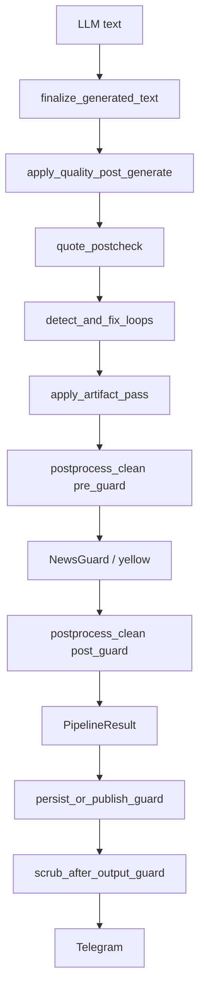

# Answer Post-Processing Module — Architecture Reference

**Audience:** architects, backend agents, and external models reviewing codebase / business process / quality policy.  
**Language:** English (technical SoT).  
**Last aligned with:** triad-flatten restore in `finalize_generated_text` + `postprocess_clean` two-phase writer (`pre_guard` / `post_guard`).

This document describes the **post-generation text quality and public-output scrub stack** for AI_Lenin. It is not a safety-policy doc (see NewsGuard / SafetyGate docs) and not a retrieval doc.

---

## 1. Purpose and business role

### 1.1 Product context

AI_Lenin generates Lenin-style news analysis for Telegram. A typical successful body is a triad:

- `Факт:` — news-grounded statement  
- `Механизм:` — class / political-economy mechanism  
- `Вывод:` — conclusion  

Public output must also carry educational disclaimer (and sometimes yellow-mode warning). The LLM and prompt scaffolding frequently leak **service debris**: stance tags, instruction echoes, markdown tails, ChatML tokens, orchestration labels (`R1`/`R2`/`R3`), citation scaffolds, encoding artifacts, and PII redaction markers.

### 1.2 Business goals of post-processing

| Goal | Meaning |
|------|---------|
| Public cleanliness | User-facing text must not show internal labels, prompt tails, or redaction placeholders |
| Structure integrity | Triad labels remain; no fake stub injection for missing sections |
| Safety coexistence | Scrub must not remove disclaimer / yellow warning; PII stays redacted (markers may be removed, names not restored) |
| Soft failure by default | Detect integrity issues; only hard-fail publish when configured `strict` |
| Observability | Every mutation emits machine-readable **codes** into pipeline metadata |

### 1.3 Explicit non-goals

- LanguageTool / grammar repair / inventing text for PII holes  
- Replacing NewsGuard / SafetyGate / PreRagCensor  
- Changing release-gate thresholds (`config/release_gates.yaml`) as part of this module  
- Re-running full body cleanup **after** NewsGuard (order is fixed)

---

## 2. End-to-end pipeline position

Post-processing sits **after LLM generation** and **around / after** safety post-filters.

```text
LLM raw text
    │
    ▼
finalize_generated_text          # text_postprocess.py
    │  strip truncation, consecutive-sentence dedupe, restore triad breaks,
    │  sentence trim, length clamp
    ▼
apply_quality_post_generate      # quality_hooks.py
    │  quote postcheck → loop fix → apply_artifact_pass → structure check
    │       apply_artifact_pass:
    │         encoding / citation / service scrub (flag-gated)
    │         postprocess_clean phase=pre_guard
    │           cleanup_answer_body + public token scrub (single writer)
    ▼
NewsGuard post-filter            # may insert «[место]», disclaimer, blocks
    │  (+ optional yellow warning footer)
    ▼
postprocess_clean phase=post_guard   # apply_terminal_public_scrub — ALWAYS after guard
    │
    ▼
PipelineResult
    │  LeninAnalyzer.clean_analysis is identity (no re-mutation)
    ▼
persist / publish re-guard → scrub_after_output_guard  # mandatory terminal scrub
    │
    ▼
Telegram / QA jsonl
    │
    ▼
format_answer_for_display        # scripts/lib/_quality_qa_txt.py — display-only for .txt artifacts
```

### 2.1 Mermaid (canonical order)



### 2.2 Two generation paths

| Path | Entry | Post-QC entry | Post-guard scrub |
|------|-------|---------------|------------------|
| Standard generation | `AnalysisGenerationPipeline` | `apply_quality_post_generate` after `finalize_generated_text` | `final_public_scrub` on guard moderated text |
| Dialectical reasoning publish | Reasoning engine rendered text | `apply_post_qc_for_reasoning` (dialectics bridge → quality stack) | Same `final_public_scrub` |

Both paths share **codes channel** via `quality_meta` / `final_public_scrub_codes`.  
`postprocess_hard_fail` can force reasoning outcome `hold_review`.

---

## 3. Module inventory (code map)

| Path | Role |
|------|------|
| `src/core/generation/text_postprocess.py` | Length / truncation / consecutive-sentence hygiene + triad break restore |
| `src/core/generation/quality_hooks.py` | Orchestrator: quotes → loops → artifacts → structure flags |
| `src/core/generation/quote_postcheck.py` | Quote grounding, attribution hallucination, path leaks |
| `src/core/generation/quote_allowlist.py` | Candidate extraction / allowlist flags |
| `src/core/generation/loop_detect.py` | Near-duplicate paragraph / sentence loop strip |
| `src/core/generation/postprocess_clean/` | **Unified contract** + two-phase engine (`pre_guard` / `post_guard`) |
| `src/core/generation/output_artifacts.py` | Trial50-style artifact pass + **`final_public_scrub`** (public-token rules) |
| `src/core/generation/answer_body_cleanup.py` | **Core body debris scrub** + soft integrity (pre_guard body rules) |
| `src/core/generation/publishability.py` | Gate: structure / hard-fail / `postprocess_status=blocked` / dialectical hold |
| `src/core/generation/pipeline.py` | Wires finalize → quality → guard → terminal `post_guard` |
| `src/core/dialectics/pipeline_bridge.py` | `apply_post_qc_for_reasoning` |
| `src/core/safety/post_generate_gates.py` | Post-generate safety gates (adjacent) |
| `src/core/safety/news_guard.py` | May insert `«[место]»` during PII redact |
| `src/core/settings/quality_postcheck_config.py` | Pydantic config loader |
| `config/quality_postcheck.yaml` | Runtime SoT for flags/thresholds |
| `scripts/lib/_quality_qa_txt.py` | Human QA `.txt` formatter (not production Telegram path) |

**Config SoT ownership:** quality postcheck knobs live in `config/quality_postcheck.yaml` (see also `docs/config_ownership.md`). Hotfix child flags under `trial50_hotfixes` are read via `src/core/safety/hotfix_flags.py` (`generation_flag_enabled`).

---

## 4. Configuration knobs (business + ops)

File: `config/quality_postcheck.yaml` → model `QualityPostcheckConfig`.

### 4.1 Flags most relevant to body / public scrub

| Key | Default (YAML) | Effect |
|-----|----------------|--------|
| `answer_body_cleanup_enabled` | `true` | Master switch for `cleanup_answer_body` |
| `integrity_check_enabled` | `true` | Run residual integrity detectors |
| `integrity_enforce_mode` | `soft` | `soft` = record codes only; `strict` = set `postprocess_hard_fail` |
| `postprocess_clean_mode` | `live` | `live` = new module writer; `shadow` = legacy writer + clone log; `off` = legacy only |
| `artifact_enforce_mode` | `soft` | Soft skips hard fallback on short/encoding |
| `hard_fallback_on_broken_output` | `false` | Template replace when broken/short (strict path) |
| `loop_fix_enabled` | `true` | Enable loop strip |
| `loop_regen_enabled` | `false` | Regen on loop (shares LLM budget; off) |
| `quote_allowlist_enabled` | `true` | Quote postcheck path |
| `quote_postcheck_enforce_mode` | `soft` | Soft keeps body after quote strip |
| `yellow_output_filter_enabled` | `false` | Post-gen yellow pattern blocks (pre-LLM owns yellow) |
| `min_meaningful_chars` | `40` | Too-short after strip |
| `fallback_templates` / `static_*` | templates | Safe fallbacks |
| `trial50_hotfixes.loop_strip_enabled` | `true` | Citation/scaffold/service strip inside artifact pass |
| `trial50_hotfixes.encoding_scrubber_enabled` | `true` | Encoding detect / limited repair |

Kill-switch practice: set relevant flags false in YAML and restart process (documented at top of YAML).

---

## 5. Layer detail

### 5.1 `finalize_generated_text` (`text_postprocess.py`)

**When:** immediately after LLM (standard path).  
**Ops:**

1. Strip `...[truncated]` leaks  
2. Dedupe exact consecutive sentences (remaining sentences are joined with a space — this can flatten triad newlines)  
3. `restore_triad_section_breaks` — re-insert `\n` before `Факт` / `Механизм` / `Вывод` after `.!?…` so later `^` / `\\n` section regexes still match  
4. Truncate to last complete sentence  
5. Clamp to `MAX_FINAL_ANSWER_CHARS` (1800) at sentence boundary when possible  

**Outputs:** cleaned text + metadata (`consecutive_repeat_removed`, `answer_len_clamped`).

If restore is skipped, live QA shows inline `Механизм :` / `Вывод :` and cleanup misses trailing triad restarts.

---

### 5.2 `apply_quality_post_generate` (`quality_hooks.py`)

**Orchestration order (fixed):**

1. Optional news encoding detect  
2. Legacy quote strip if answer has quotes but no context quotes/candidates  
3. `apply_quote_postcheck` (if allowlist enabled)  
4. `detect_and_fix_loops`  
5. `apply_artifact_pass` (encoding/citation/service + **`postprocess_clean` `pre_guard`**)  
6. Optional grounded-element metadata vs R1 brief  
7. Structure check for `Факт` / `Механизм` / `Вывод` — **never injects stub text**; sets `structure_error` if missing  

**Important metadata keys:**  
`artifact_ops`, `body_cleanup_codes`, `integrity_codes`, `integrity_error`, `postprocess_hard_fail`, `structure_ok`, `structure_error`, quote/loop fields.

---

### 5.3 Quote postcheck (`quote_postcheck.py`)

Business rule: attributed Lenin quotes / volume-page claims must be grounded in allowlisted RAG candidates. Otherwise strip or fall back to static template (mode-dependent). Also scrubs filesystem / `[source:…]` path leaks.

---

### 5.4 Loop fix (`loop_detect.py`)

Detects near-duplicate paragraphs via Jaccard token overlap (`config.loop`). Cheap strip of later duplicates. Regen path exists but is off by default.

---

### 5.5 `apply_artifact_pass` (`output_artifacts.py`)

Single “detect → strip → optional fallback/deny” pass.

**Typical ops (when loop-strip hotfix on):**

- Limited mojibake fix (`Рё` → `её` in isolated cases)  
- Encoding artifact detect (soft keep vs hard fallback)  
- Citation debris: empty principle, star-Lenin without volume, year-only cites without grounded title  
- Scaffold headers (`Суть тезиса`, etc.)  
- Style lead (`В стилизованной интерпретации…`)  
- Redact token normalize: `[обезличено]` / source/cite tags → temporary `«[место]»` (then often removed by early `final_public_scrub`)  
- Service tokens: ChatML, `[multi-stance]`, `R1`/`R2`/`R3`, empty slots, evidence-base prompt echoes, context labels  

Then:

1. `postprocess_clean` `pre_guard` (`cleanup_answer_body` + public token scrub, single writer)  
2. Broken-syntax / too-short checks → optional template / combat deny  

**Return type:** `ArtifactPassResult(text, codes, used_fallback, deny, metadata)`.

**Do not skip `post_guard` after NewsGuard.** Pre-guard public scrub does not see Guard-inserted `«[место]»`.

---

### 5.6 `cleanup_answer_body` (`answer_body_cleanup.py`) — core body scrub

**Timing:** inside artifact pass, conceptually **pre-NewsGuard**.  
**Invariant:** trailing yellow warning / disclaimer are split off (`_protect_safety_tails`) so scrub does not erase them, then reattached. Disclaimer glued onto the same line as `Вывод` (after sentence flatten) is split at the hint, not treated as a whole-line footer.

#### Pipeline inside body cleanup

1. `normalize_section_headers` — stray `*` lines; section-boundary `**Факт:**` / `**Механизм:**` / `**Вывод:**` → plain labels; **inline or line-start** label spacing (`Механизм :` → `Механизм:`)  
2. `scrub_synthetic_stance` — Lenin / RU stance tags with `(core_…)` including broken `core_ Lenin`  
3. `scrub_instruction_dumps` — `Запрещено …` sentences; prompt-task tail `Задача: краткий анализ…` (multi-marker, end-anchored)  
4. `scrub_markdown_debris` — empty `--- [empty] ---` scaffolds; **terminal** and post-sentence **clusters** of `---` / `##` only (not global separators in prose)  
5. `truncate_trailing_triad_restart` — after first `Вывод`, cut restart of triad (line-start **or** inline after `.!?…` with optional `---` / `[…]` debris); strip trailing markdown before the cut; exact trailing Fact dup coded separately  
6. Whitespace normalize; re-run stance / instruction / md scrub  
7. `detect_integrity_issues` → soft/strict enforce  

#### Integrity residual codes (detect-only unless strict)

| Code | Meaning |
|------|---------|
| `artifact:mojibake_sg` / `mojibake_ryo` / `latin_island` / `replacement_char` | Encoding smells |
| `integrity:hole_syntax` | Broken Russian fragments (`что ,`, `о может`, …) |
| `integrity:residual_stance` | Stance tag still present |
| `integrity:residual_instruction` | Instruction dump remains |
| `integrity:prompt_task_echo` | Prompt task tail remains |
| `integrity:md_debris` | Markdown debris remains |
| `integrity:mesto_marker` | Visible mesto/obezlicheno still in body at this stage |

**Strict mode:** `postprocess_hard_fail=True` (+ code `deny:postprocess_hard_fail`).  
**Soft mode (default):** publish may still proceed; codes remain for metrics / QA.

#### Mutation codes (examples)

`strip:inline_stance_lenin`, `strip:inline_stance_ru_label`, `strip:stance_debris`, `strip:instruction_dump`, `strip:prompt_task_tail`, `strip:empty_md_scaffold`, `strip:md_debris_cluster`, `strip:terminal_md_debris`, `strip:stray_asterisk_line`, `fix:inline_bold_label`, `fix:label_bold_junk`, `fix:label_spacing`, `strip:trailing_exact_fact_dup`, `strip:trailing_triad_restart`.

#### Negative / safety rules baked into regex design

- Do not cut bare prose like «Ленин подчёркивал»  
- Do not cut legitimate single `---` inside mechanism prose  
- Do not cut URLs / paths with `/критикой` unless full prompt-task multi-marker pattern matches  
- Bold-label normalize only at section boundaries (start / newline / after `.!?`)

---

### 5.7 `postprocess_clean` `post_guard` — public always-on scrub

**API:** `run_postprocess(PostProcessInput(phase="post_guard"))` / `apply_terminal_public_scrub` / `scrub_after_output_guard`.  
**Implementation:** `final_public_scrub` in `output_artifacts.py`.

**Called:** after NewsGuard / yellow in `pipeline.py`, and again after persist/publish `guard_output`.

**Why after Guard:** NewsGuard PII redact inserts `«[место]»` **after** body cleanup. Visible markers must disappear from Telegram / jsonl answers without restoring PII.

**Ops:**

1. Service token scrub (ChatML, multi-stance, R-labels, empty slots, cite debris, context stance echo, evidence-base)  
2. Style lead / inline style tail / context label lines / trailing `---`  
3. Strip `«[место]»` / `[место]` / `[обезличено]` → collapse spaces, empty guillemets, doubled punctuation  
4. Residual mesto wipe if any remain  
5. Collapse excess newlines / spaces  

**Codes:** e.g. `strip:mesto_marker`, `strip:empty_quotes_after_mesto`, `strip:chatml_token`, …  
Stored as `quality_meta["final_public_scrub_codes"]` and `postprocess_codes_post_guard` when non-empty.

**Policy:** `_PLACEHOLDER_MESTO_ALLOWED = False` — visible redaction markers are not considered acceptable public copy.

**Invariant:** no text mutation after the last `post_guard` (`LeninAnalyzer.clean_analysis` is identity).

---

### 5.8 Publishability (`publishability.py`)

`is_publishable_analysis(text, metadata)` returns false when:

- Error placeholder text  
- `structure_error`  
- `postprocess_hard_fail`  
- `postprocess_status == "blocked"`  
- Dialectical outcome `hold_review` / `suppress`  
- Orchestration mode `error`  
- (and related groundedness+structure combinations)

This is the business gate between “generated” and “allowed to publish / count as QA done success.”

---

### 5.9 Display-only formatter (`scripts/lib/_quality_qa_txt.py`)

**Not production Telegram formatting.** Used by quality / live QA batch writers.

Fixes display bugs even when raw still has `**Механизм:**`:

1. Normalize `\*{0,2}(Факт|Механизм|Вывод)\*{0,2}\s*:\s*\*{0,2}` → `Label: `  
2. Split on section lookahead  
3. Drop chunks that are only `*+`  
4. Keep disclaimer order  

Orphan lone `*` lines in `.txt` artifacts (seen in live QA item #24) were display bugs, not jsonl content.

---

## 6. Data contracts

### 6.1 Result objects

```text
PostProcessInput:
  raw_text, phase: pre_guard|post_guard
  combat_sensitive, item_id, skip_structure_enforce, config

PostProcessResult:
  cleaned_text
  status: clean|blocked|needs_review
  codes, error_details
  postprocess_hard_fail, structure_error
  integrity_error, integrity_codes, body_cleanup_codes

BodyCleanupResult:
  text: str
  codes: list[str]           # mutation codes
  metadata:
    body_cleanup_codes
    integrity_codes
    integrity_error: bool
    postprocess_hard_fail: bool
    integrity_enforce_mode: str

ArtifactPassResult:
  text, codes, used_fallback, deny, metadata

final_public_scrub(text) -> (text, codes)
```

`status` is an adapter over existing flags (`blocked` ← hard_fail/deny; `needs_review` ← structure_error). NewsGuard `blocked` stays outside this module.

### 6.2 Expected analysis shape

Public analysis ideally contains:

```text
Факт: ...
Механизм: ...
Вывод: ...

Ответ сгенерирован ИИ ...
[optional] Ограниченный режим анализа: ...
```

Missing triad → `structure_error` (hold), not silent stub rebuild.

---

## 7. Interaction with adjacent systems

| System | Interaction |
|--------|-------------|
| **Prompt adapter** | Source of prompt-task echoes (`Задача: краткий анализ…`) scrubbed in body cleanup |
| **NewsGuard** | Inserts disclaimer / PII `«[место]»`; post-guard `final_public_scrub` removes visible markers |
| **SafetyGate yellow** | Warning appended; body cleanup protects yellow/disclaimer tails |
| **Dialectical reasoning** | Shares post-QC; hard-fail / structure issues can force `hold_review` |
| **PreRagCensor / censor YAML** | Upstream topic blocking — orthogonal to answer scrub |
| **QA batch scripts** | Persist post-scrub answers; txt formatter is extra display pass |
| **Release gates** | Separate eval thresholds; postprocess soft integrity is not release SoT |

---

## 8. Testing and calibration assets

| Asset | Role |
|-------|------|
| `tests/fixtures/answer_postprocess/*.in.txt` / `*.out.txt` | Golden pairs |
| `tests/fixtures/answer_postprocess/qa2229_fixture_ids.json` | Maps fixture names → live QA-2229 answer ids (force-added; `*.json` normally gitignored) |
| `tests/test_answer_body_cleanup.py` | Unit + negatives + integrity codes |
| `tests/test_output_artifact_hardening.py` | Artifact pass + mesto final scrub |
| `tests/test_quality_qa_batch_io.py` | Display formatter / orphan `*` |
| `tests/test_qa2229_debris_replay.py` | Replay scrub on live jsonl `done` rows → zero debris hits |
| `tests/test_postprocess_clean.py` | Contract, phases, fixtures, persist helper |
| `tests/test_postprocess_clean_runtime.py` | Shadow vs live/off, analyzer identity |

**Calibration source:** `.cursor/artifacts/quality/live_news_qa_50_20260813-2229_*.jsonl` (local artifact; may be untracked).

Targeted verification:

```powershell
.venv\Scripts\python.exe -m pytest tests/test_postprocess_clean.py tests/test_postprocess_clean_runtime.py tests/test_answer_body_cleanup.py tests/test_output_artifact_hardening.py tests/test_quality_qa_batch_io.py tests/test_qa2229_debris_replay.py -q
```

---

## 9. Operational playbook

### 9.1 Soft vs strict integrity

- **Production default:** soft — log `integrity_*` codes; still publish if other gates pass.  
- **Strict:** use for experiments / hard QA bars; expect more `hold_review` / non-publishable outcomes.

### 9.2 Debugging a dirty answer

1. Inspect `body_cleanup_codes`, `integrity_codes`, `artifact_ops`, `final_public_scrub_codes`, `postprocess_status` in metadata / jsonl.  
2. Confirm whether debris appeared **before** or **after** NewsGuard (mesto → after).  
3. Reproduce with fixture or `run_postprocess` (`pre_guard` then `post_guard`) offline.  
4. Prefer extending regex with **negative tests** (legitimate prose / URLs / single `---`).  

### 9.3 Changing scrub safely

- Prefer narrow anchors (terminal / multi-marker / section-boundary).  
- Never invent entity names for redaction holes.  
- Do not reorder Guard vs body cleanup without updating this doc and pipeline tests.  
- Keep files under ~200 lines by splitting helpers if growth continues (`file-size-splitting` rule).

---

## 10. Known defect classes addressed (QA-2229)

| Defect | Layer that fixes it |
|--------|---------------------|
| `— Ленин (core_ Lenin )` | `cleanup_answer_body` stance scrub |
| `--- ## --- ##.` | Markdown debris scrub |
| `Задача: краткий анализ… /критикой…` | Prompt-task tail scrub |
| Orphan `*` in `.txt` only | `format_answer_for_display` |
| Public `«[место]»` | `final_public_scrub` after Guard |
| Flattened triad (`Факт: …. Механизм : …`) | `restore_triad_section_breaks` + `fix:label_spacing` |
| `--- [empty] ---` trailing restart | `strip:empty_md_scaffold` + trailing triad restart |

---

## 11. Glossary

| Term | Meaning |
|------|---------|
| Triad | `Факт` / `Механизм` / `Вывод` required analysis sections |
| Stance tag | Synthetic label like `Ленин (core_approval)` leaked from orchestration |
| Soft integrity | Detect residual defects without hard publish deny |
| Public scrub | Always-on cleanup for user-visible text after safety footers |
| Artifact pass | Combined encoding/citation/service/body/final scrub decision unit |
| Mesto marker | Visible PII placeholder `«[место]»` / `[обезличено]` |

---

## 12. Suggested reading order for external models

1. This document  
2. `config/quality_postcheck.yaml`  
3. `src/core/generation/postprocess_clean/` → `quality_hooks.py` → `output_artifacts.py` → `answer_body_cleanup.py`  
4. `src/core/generation/pipeline.py` (post-LLM block + final scrub)  
5. `src/core/generation/publishability.py`  
6. Golden fixtures under `tests/fixtures/answer_postprocess/`  
7. Adjacent: `docs/safety_gate.md`, `docs/news_guard_patterns.md`, `docs/trial50_hotfix_notes.md`

---

## 13. Change log (module narrative)

| Change | Intent |
|--------|--------|
| Initial `answer_body_cleanup` + wiring into artifact pass | Centralize body debris scrub + soft integrity |
| `postprocess_clean` two-phase module | Single contract; pre_guard + mandatory post_guard; persist/publish re-guard scrub; `clean_analysis` identity |
| Triad flatten after sentence join | Restore section breaks in finalize; inline label / restart / empty-scaffold cleanup |

When extending the module, update this document in the same PR as code changes.
