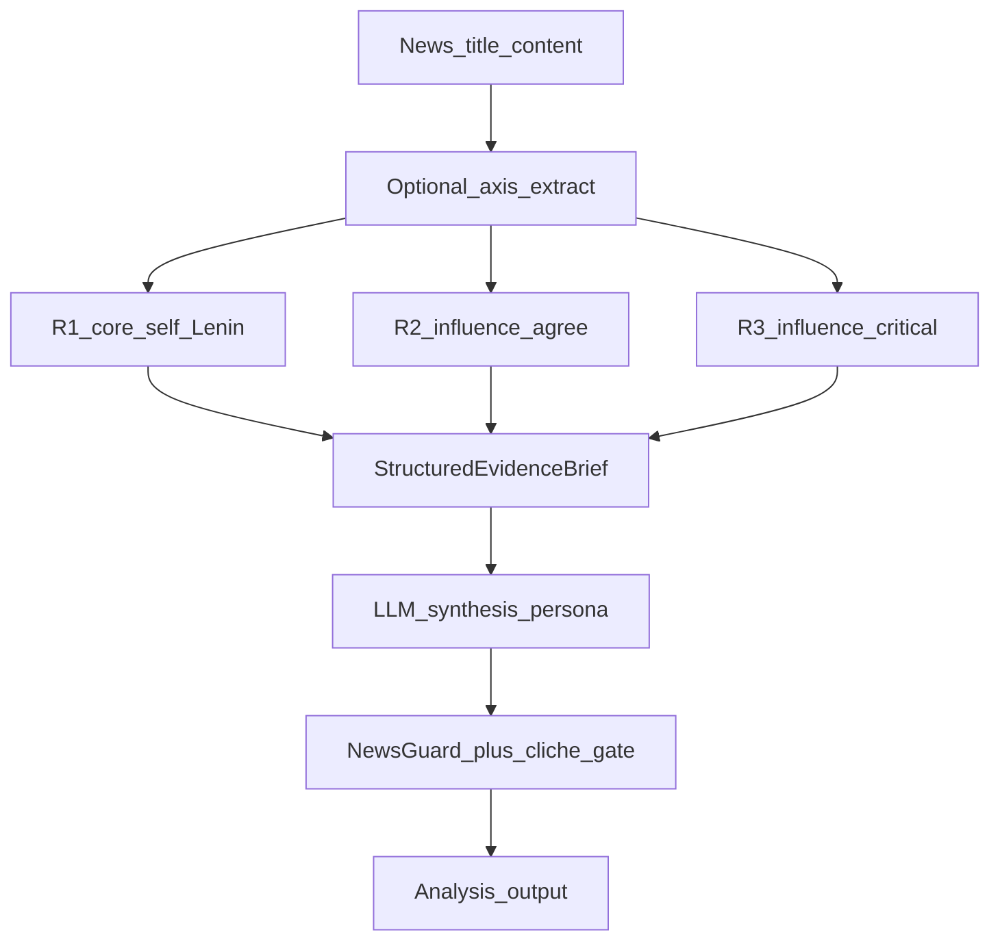

# Диалектический orchestration-слой (слоты R1–R3)

**Проект:** `P:\AI_Lenin`  
**Дата:** 2026-07-26  
**Статус:** план реализации (без ломки Qdrant / существующего retrieval)  
**Связь:** ретроспектива `P:\deepseek_history\AI_LENIN_RETROSPECTIVE.md`; разрыв «корпус в RAG → один LLM-вызов» vs модель мышления по позитивным/негативным источникам.

---

## 1. Проблема

### Задумка
1. Разметить источники (согласен / критикует / сам Ленин).  
2. По сочинениям восстановить, *как* Ленин опирался на источники.  
3. При анализе новости программно собрать всестороннюю оценку и лишь затем дать голос LLM.

### Сейчас (hot path)
```
новость → AnalysisContextOrchestrator.build_context(query)
        → один retrieve_context (merge dense/sparse/onto + stance boost)
        → AnalysisGenerationPipeline: один prompt + один context string
        → NewsGuard
```

Ключевые файлы:
- [`src/core/analysis/context_orchestrator.py`](../src/core/analysis/context_orchestrator.py) — один вызов provider/legacy RAG  
- [`src/core/generation/pipeline.py`](../src/core/generation/pipeline.py) — `context_builder(enhanced_query)` → generate  
- [`src/core/retrieval/qdrant_retrieval_provider.py`](../src/core/retrieval/qdrant_retrieval_provider.py) — уже multi-query *внутри* retrieve, но результат сплющивается в одну строку  
- [`config/retrieval_pipeline.yaml`](../config/retrieval_pipeline.yaml) — `source_boosts`: `core_self`, `influence_agree`, `influence_critical`, `contextual`

**Вывод:** stance и multi-retriever уже есть; не хватает **оркестрации слотов** и **двухфазной генерации** (evidence brief → синтез).

---

## 2. Целевая модель (слоты R1–R3)



| Слот | `stance_type` (payload Qdrant) | Смысл | Мин. chunks |
|------|-------------------------------|--------|-------------|
| **R1** | `core_self` | Прямые места у Ленина (ПСС) по теме | 2–4 |
| **R2** | `influence_agree` | Источники/авторы, на которые опирался / согласие | 1–3 |
| **R3** | `influence_critical` | Оппозиция / критика | 1–3 |

Опционально позже **R4** `contextual` — только если R1–R3 пусты (fallback, не смешивать в основной brief без пометки).

LLM на этапе синтеза **не** должна «додумывать» цитаты: только блоки brief + новость.

---

## 3. Принцип «без ломки Qdrant»

| Не трогаем | Меняем / добавляем |
|------------|-------------------|
| Коллекция Qdrant, ingest, sparse/dense vectors | Фильтр `stance_type` в query (payload filter уже используется в ingest/scroll) |
| `RetrievalCandidate`, RRF, stance boost как библиотека | Новый API «retrieve по слоту» рядом со старым |
| `retrieve_context` / legacy путь | Feature-flag: старый путь остаётся default или shadow |
| NewsGuard post-filter | Подключение cliché-gate *после* синтеза (отдельный этап) |

Обратная совместимость:  
`build_context(query) -> str` сохраняется как обёртка над brief (склейка секций) для старых тестов/dry-run.

---

## 4. Контракты данных

### 4.1. `EvidenceSlot` / `EvidenceBrief`

Новый модуль (предложение): `src/core/analysis/evidence_brief.py`

```python
@dataclass(frozen=True)
class EvidenceItem:
    stance_type: str          # core_self | influence_agree | influence_critical
    source_id: str
    source_path: str
    chunk_id: str
    text: str
    score: float
    retriever: str            # dense | sparse | onto
    query_used: str

@dataclass
class EvidenceBrief:
    news_title: str
    news_content: str
    axes: list[str]           # краткие оси анализа (опционально)
    r1_core_self: list[EvidenceItem]
    r2_influence_agree: list[EvidenceItem]
    r3_influence_critical: list[EvidenceItem]
    warnings: list[str]       # e.g. "R1 empty", "R3 weak"
    trace: dict               # для debug / eval
```

Метод рендера для LLM:

```text
## R1 — Ленин (core_self)
[1] (source_path) "цитата..."

## R2 — Опоры (influence_agree)
...

## R3 — Критика / оппозиция (influence_critical)
...

## Оси
- ...
```

### 4.2. Расширение provider API (аддитивно)

В `QdrantRetrievalProvider` (и протоколе provider):

```python
def retrieve_by_stance(
    self,
    query_text: str,
    *,
    stance_types: list[str],
    limit: int,
    apply_internal_multi_query: bool = True,
) -> list[RetrievalCandidate]:
    ...
```

Реализация `_dense_search` / `_sparse_search`: добавить опциональный `query_filter`:

```python
models.Filter(
    must=[
        models.FieldCondition(
            key="stance_type",
            match=models.MatchAny(any=stance_types),  # или MatchValue для одного
        )
    ]
)
```

**Важно:** не удалять текущий `retrieve_with_trace` без фильтра — он нужен для A/B и sandbox.

Индекс payload: при необходимости убедиться, что `stance_type` indexed в Qdrant (если filter медленный — отдельный follow-up, не блокер MVP).

---

## 5. Изменения по файлам

### 5.1. `AnalysisContextOrchestrator` → dual API

Файл: [`src/core/analysis/context_orchestrator.py`](../src/core/analysis/context_orchestrator.py)

**Сейчас:** только `build_context(enhanced_query) -> str`.

**Цель:**

```python
class AnalysisContextOrchestrator:
    def build_evidence_brief(
        self,
        *,
        news_title: str,
        news_content: str,
        enhanced_query: str,
    ) -> EvidenceBrief: ...

    def build_context(self, enhanced_query: str) -> str:
        # backward-compat: brief без news → render flat
        ...
```

Алгоритм `build_evidence_brief` (MVP):

1. `axes = extract_axes(news_title, news_content, enhanced_query)`  
   - MVP: rule-based из `extract_key_concepts` / taxonomy concepts (без лишнего LLM).  
   - Later: один маленький LLM-call «3 оси», кэшировать.
2. `query = enhanced_query` (+ опционально дописать оси в query string).  
3. Параллельно (или последовательно):
   - `R1 = provider.retrieve_by_stance(query, stance_types=["core_self"], limit=k1)`
   - `R2 = ... ["influence_agree"], limit=k2`
   - `R3 = ... ["influence_critical"], limit=k3`
4. Если R1 пуст: один fallback `retrieve_by_stance` без filter с post-filter `stance==core_self`, иначе warning + ослабленный legacy `author_filter="Ленин"`.  
5. Dedup по `chunk_id` внутри слота; не тащить один chunk в два слота.  
6. Собрать `EvidenceBrief` + `warnings`.

Legacy `_from_legacy_rag` оставить для chroma-only / provider=None.

### 5.2. `AnalysisGenerationPipeline`

Файл: [`src/core/generation/pipeline.py`](../src/core/generation/pipeline.py)

**Сейчас:**
```python
context = self.context_builder(enhanced_query)
# один request
```

**Цель (feature-flag `dialectical_orchestration: true`):**

```python
brief = self.evidence_builder(...)  # build_evidence_brief
context = brief.render_for_prompt()
request = build_*_request(..., context=context, brief_meta=...)
# generate
# optional: cliche_gate(analysis, brief)
```

Сигнатура `context_builder` либо:
- расширяется до callable, возвращающего `str | EvidenceBrief`, или  
- в pipeline передаются два callable: `evidence_builder` + fallback `context_builder`.

Рекомендация: **два callable** — меньше ломает тесты, где мокают `context_builder -> str`.

`PipelineResult.metadata` дополнить:
- `r1_count`, `r2_count`, `r3_count`
- `warnings`
- `orchestration_mode`: `legacy` | `dialectical_v1`

### 5.3. `prompt_adapter.py`

Файл: [`src/core/generation/prompt_adapter.py`](../src/core/generation/prompt_adapter.py)

Добавить вариант промпта (или ветку), который:

1. Явно описывает секции R1/R2/R3.  
2. Требует: тезис из R1 обязателен, если R1 не пуст; R2/R3 — «опора / полемика».  
3. Запрещает ответ из одних клише без ссылки на R1.  
4. Сохраняет существующие safety-запреты из `GIGACHAT_SYSTEM_PROMPT`.

Пример структуры user message:

```text
Новость: ...
Оси: ...

Доказательная база (не выдумывай вне этих блоков):
## R1 ...
## R2 ...
## R3 ...

Задача: краткий анализ в стиле Ленина, связывающий новость с R1 и при необходимости с опорой/критикой из R2/R3.
```

### 5.4. Конфиг

Новый фрагмент в `config/retrieval_pipeline.yaml` или `config/generation.yaml`:

```yaml
dialectical_orchestration:
  enabled: false          # default OFF — без ломки текущего поведения
  r1_limit: 4
  r2_limit: 3
  r3_limit: 3
  require_r1: true        # если false — синтез всё равно идёт с warning
  include_axes_in_query: true
  fallback_to_legacy_context: true
```

### 5.5. `LeninAnalyzer`

Файл: [`src/core/lenin_analyzer.py`](../src/core/lenin_analyzer.py)

При сборке pipeline:

```python
AnalysisGenerationPipeline(
    context_builder=self.context_orchestrator.build_context,  # legacy
    evidence_builder=self.context_orchestrator.build_evidence_brief,  # new
    ...
)
```

Читать флаг из generation/retrieval config.

---

## 6. Фазы внедрения

### Phase 0 — подготовка (0.5–1 день)
- [ ] Проверить распределение `stance_type` в коллекции (`scripts/retrieval/audit_retrieval_foundations.py`).  
- [ ] Зафиксировать % пустых слотов на 20–50 реальных новостях (dry-run только retrieval).  
- [ ] Если `influence_critical` / `agree` слишком редки — план доразметки registry (отдельный трек данных, не блокер кода слотов).

### Phase 1 — provider filter API (1 день)
- [ ] `retrieve_by_stance` + payload filter в dense/sparse.  
- [ ] Unit-тесты с mock Qdrant client / fixture points.  
- [ ] Не менять default `retrieve_context` поведение.

### Phase 2 — EvidenceBrief + orchestrator (1–2 дня)
- [ ] `evidence_brief.py` + `build_evidence_brief`.  
- [ ] `build_context` = render(brief) при flag, иначе старый путь.  
- [ ] Тесты: три слота заполняются разными stance; dedup; empty R1 → warning.

### Phase 3 — generation pipeline + prompts (1 день)
- [ ] Pipeline dual-builder + metadata.  
- [ ] Промпт под секции R1–R3.  
- [ ] Сравнение dry-run: `legacy` vs `dialectical_v1` на 10 новостях (ручной взгляд).

### Phase 4 — quality gates (1–2 дня)
- [ ] Простейший cliché detector: если ответ матчит только клише-лексику и `r1_count==0` или нет overlap токенов с R1 → `warn` / block в warn_only.  
- [ ] Метрика в eval: «доля ответов с provenance из R1».  
- [ ] Документировать в README (кратко) + этот файл как SoT.

### Phase 5 — (опционально) оси через LLM
- [ ] Малый call «extract 3 dialectical axes» перед R1–R3.  
- [ ] Кэш по hash(news).  
- [ ] Не включать, пока Phase 1–3 не стабильны.

---

## 7. Что сознательно не делаем в MVP

- Не переобучаем LoRA «стилю мышления» заново — сначала программный маршрут внимания.  
- Не требуем OWL/RDF.  
- Не удаляем Chroma migration / `ab_shadow`.  
- Не смешиваем R1–R3 обратно в один RRF до слотовой нарезки (boost внутри слота допустим).  
- Не тащим UMAP/NetworkX UX.

---

## 8. Тест-план

| Тест | Ожидание |
|------|----------|
| `test_retrieve_by_stance_filter` | В выдаче только запрошенный stance |
| `test_brief_slots_partition` | Один chunk_id не в двух слотах |
| `test_legacy_build_context_unchanged` | При `enabled: false` текст/контракт как раньше |
| `test_pipeline_metadata_counts` | metadata содержит r1/r2/r3 |
| `test_prompt_contains_section_headers` | User/system содержат `## R1`… |
| Manual dry-run 10 новостей | При непустом R1 ответ ссылается на ПСС-provenance чаще, чем legacy |

---

## 9. Риски и митигации

| Риск | Митигация |
|------|-----------|
| Пустой R3 на многих новостях | Warning + синтез на R1(+R2); доразметка critical |
| Filter по stance режет recall | Fallback: unfiltered top-N → post-filter by stance |
| Увеличение latency ×3 query | Общий encode query один раз; parallel dense/sparse; кэш embedding |
| Промпт слишком длинный | Лимиты k1/k2/k3 + truncate per slot |
| Карикатура остаётся | Phase 4 cliché gate + требование R1 |

---

## 10. Критерий готовности MVP

1. Флаг `dialectical_orchestration.enabled` включает слоты R1–R3 без изменения Qdrant-схемы.  
2. При `enabled: false` все существующие тесты/поведение зелёные.  
3. `PipelineResult` отдаёт brief-метаданные для отладки.  
4. На выборке новостей с непустым `core_self` доля ответов с опорой на R1 визуально/метрически выше baseline legacy.  
5. Этот документ актуален и указан из README или AGENTS.md одной ссылкой.

---

## 11. Порядок работ для Cursor/агента (чеклист)

1. Добавить `retrieve_by_stance` + тесты.  
2. Добавить `EvidenceBrief` + `build_evidence_brief`.  
3. Протянуть flag в config + `LeninAnalyzer` / pipeline.  
4. Обновить `prompt_adapter` под секции.  
5. Dry-run script: `scripts/dialectics/run_dialectical_dryrun.py` (новость → brief JSON + analysis).  
6. Включить flag на stage/local; prod — после ручной приёмки.  
7. (Следом) anti-cliché gate и доразметка stance.

---

## 12. Связь с ретроспективой

| Долг из AI_LENIN_RETROSPECTIVE | Как закрывает этот план |
|-------------------------------|-------------------------|
| Worldview/ontology не в каждом анализе | Слоты + оси из taxonomy — программный маршрут |
| Anti-stereotype absent | Phase 4 gate + обязательность R1 |
| «Всё свалено в RAG» | Явная диалектика R1/R2/R3 вместо одного merge |

---

*Конец плана. Реализация кода — отдельным PR/сессией; этот файл не меняет runtime.*

---

## Runtime API (implemented)

- `AnalysisContextOrchestrator.build_evidence_brief(...) -> EvidenceBrief` (always returns brief; modes in `trace.orchestration_mode`: `dialectical_v1` | `legacy_fallback` | `error`).
- `QdrantRetrievalProvider.retrieve_by_stance(query_text, stance_types=..., limit=...)`.
- Config: `dialectical_orchestration.*` in `config/retrieval_pipeline.yaml` (`enabled: true` in current YAML; originally shipped default-off).
- Ops: `scripts/retrieval/ensure_qdrant_stance_index.py` (one-shot per DB; see README).
- Dry-run: `scripts/dialectics/run_dialectical_dryrun.py`.
- Anti-cliché (Phase 4 helper): `src/core/safety/cliche_gate.py`.

**Reasoning layer (separate):** see [`dialectical_reasoning_engine.md`](dialectical_reasoning_engine.md) — `dialectical_reasoning.mode` in the same YAML. Orchestration builds EvidenceBrief; reasoning synthesizes grounded analysis.
