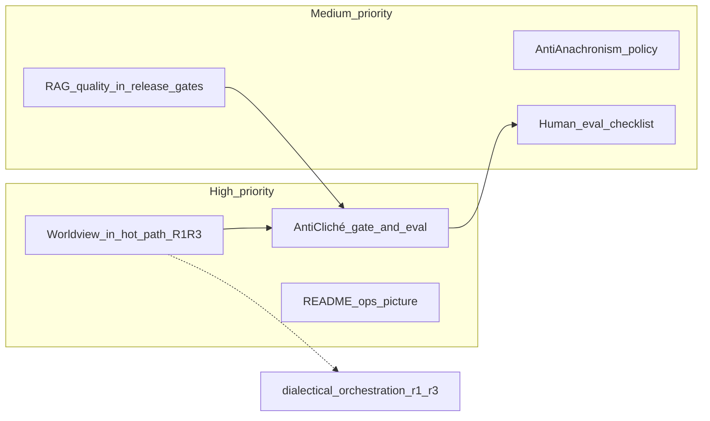

# План: вернуть смысл кризиса 2025-08 + дожать уже начатое

**Проект:** `P:\AI_Lenin`  
**Дата:** 2026-07-26  
**Статус:** план работ (приоритеты High / Medium)  
**Источники:**  
- [`dialectical_orchestration_r1_r3.md`](dialectical_orchestration_r1_r3.md) — детальный план слотов R1–R3  
- `P:\deepseek_history\AI_LENIN_RETROSPECTIVE.md`  
- `P:\deepseek_history\AI_LENIN_EXECUTIVE_SUMMARY.md`

---

## 0. Зачем этот документ

Ретроспектива зафиксировала: инфраструктура (Qdrant, NewsGuard, RAG eval) ушла вперёд, а **смысл кризиса карикатуры** (август 2025: одномерные ответы «революция / эксплуатация») так и не получил измеримого контура.

Этот файл — **roadmap приоритетов**. Детали диалектического retrieve вынесены в [`dialectical_orchestration_r1_r3.md`](dialectical_orchestration_r1_r3.md); здесь — цели, зависимости, фазы, критерии приёмки и что не делать.



**Порядок:** H2 (оркестрация) и H1 (анти-клише) — ядро; H3 параллельно; Medium — сразу после или внахлёст с H1.

---

## 1. Высокий приоритет — вернуть смысл кризиса

Кризис в чатах (`a82883b0`, `02d9f2ba`): модель даёт **карикатурно-стереотипный** образ вместо анализа.  
Инженерный ответ кризиса был «онтология → шаблон → этапы 1–4», но в проде остался риск: **один RAG-мешок + persona → снова клише**.

### H2. Worldview / диалектика в hot path (не offline-only)

**Суть:** каждый news-анализ идёт через слоты R1–R3 (Ленин / опоры / оппозиция), затем синтез.

| | |
|--|--|
| **Спека** | Полностью в [`dialectical_orchestration_r1_r3.md`](dialectical_orchestration_r1_r3.md) |
| **Зависимости** | Qdrant + `stance_type` в payload (уже есть); feature-flag `dialectical_orchestration.enabled` |
| **Файлы** | `context_orchestrator.py`, `qdrant_retrieval_provider.py`, `pipeline.py`, `prompt_adapter.py`, config yaml |
| **Не дублировать здесь** | API `retrieve_by_stance`, `EvidenceBrief`, фазы 0–5 оркестрации |

**Критерий «кризис закрыт на уровне маршрута»:**  
при `enabled: true` анализ всегда получает структурированный brief с секциями R1–R3 (или явные `warnings`, если слот пуст) — не плоский merge без меток.

**Чеклист приёмки H2:** см. §10–11 в `dialectical_orchestration_r1_r3.md`.

---

### H1. Anti-stereotype / anti-cliché как first-class

**Суть:** сделать регресс карикатуры **видимым и блокируемым** (или warn-only на старте).

Это **не** замена R1–R3: оркестрация даёт evidence; H1 проверяет, что ответ не игнорирует evidence и не скатывается в клише.

#### H1.1. Лексикон и фикстуры

Создать (предложение путей):

| Артефакт | Назначение |
|----------|------------|
| `config/anti_cliche.yaml` | Паттерны/фразы-клише; пороги; режим `warn_only` / `block` |
| `tests/fixtures/cliche_news/` | 5–10 новостей + «плохие» эталонные ответы-клише + «хорошие» с опорой на цитату |
| `data/eval/anti_cliche_cases.jsonl` | Машиночитаемые кейсы для CI |

Минимальный набор клише-маркеров (стартовый, расширять по логам):  
односложные связки вроде эксплуатации/революции/диктатуры **без** provenance и без конкретики новости.

#### H1.2. Детектор (MVP)

Новый модуль: `src/core/safety/cliche_gate.py` (рядом с NewsGuard)

Правила MVP (комбинировать):

1. **R1-empty + high cliché density** → fail/warn.  
2. **Token overlap** ответа с текстами R1 ниже порога при `r1_count > 0` → warn.  
3. **Blacklist n-grams** из yaml (регистронезависимо) при отсутствии цитатного якоря → warn.  
4. Не блокировать валидный короткий ответ, если есть явная отсылка к R1 provenance.

Интеграция в [`src/core/generation/pipeline.py`](../src/core/generation/pipeline.py) **после** generate, **до или рядом** с `NewsGuard.guard_output`:

```text
generate → text_cleaner → NewsGuard.mark_unverified_facts
         → ClicheGate.evaluate(analysis, brief)
         → NewsGuard.guard_output
```

`PipelineResult.metadata` / `hallucination_codes`: добавить коды вроде `cliche_no_r1`, `cliche_low_r1_overlap`.

#### H1.3. Тесты и eval

| Тест | Ожидание |
|------|----------|
| `tests/test_cliche_gate.py` | Клише-фикстура → warn/block; хороший ответ с R1 → pass |
| Расширение `scripts/retrieval/evaluate_rag_quality.py` или новый `scripts/quality/evaluate_anti_cliche.py` | Доля fail на gold set; тренд в артефактах |
| Опционально в `scripts/ops/release_pass.py` | Gate при `ANTI_CLICHE_GATE=1` |

#### H1.4. Фазы H1

| Фаза | Работа | Done when |
|------|--------|-----------|
| H1-a | yaml + фикстуры + unit gate без wire в pipeline | тесты зелёные offline |
| H1-b | wire в pipeline, `warn_only: true` | metadata пишется в dry-run |
| H1-c | метрика в eval script | отчёт % fail на 20+ кейсах |
| H1-d | ужесточение (`block` на stage) | после ручной приёмки |

**Зависимость:** H1-b лучше после минимального H2 (`EvidenceBrief` доступен pipeline). До H2 можно гонять gate на legacy context с упрощённым R1≈«есть ли chunk stance=core_self в context string».

---

### H3. README и операционная картина

**Суть:** знание сейчас в `.cursor/artifacts` и чатах; `README.md` ≈ stub → решения снова «потеряются».

#### Содержание README (минимум)

1. Что это за продукт (news-RAG, локально, Telegram).  
2. Hot path схема (ссылка на Mermaid из dialectical doc).  
3. Stance-слои: `core_self` / `influence_agree` / `influence_critical`.  
4. Как запустить: env, llama-server / backend, Qdrant path.  
5. Как проверить качество:
   - `scripts/quality/run_local_rag_dryrun.py`
   - `scripts/retrieval/evaluate_rag_quality.py`
   - `scripts/safety/evaluate_news_guard.py`
   - (после H1) anti-cliché eval  
6. Feature-flags: `dialectical_orchestration`, anti-cliché mode.  
7. Ссылки: этот файл + `dialectical_orchestration_r1_r3.md`.

#### Дополнительно

| Файл | Зачем |
|------|-------|
| `docs/README.md` или индекс в корне docs | Оглавление планов |
| Короткая секция в `AGENTS.md` | Куда смотреть агенту |

**Критерий приёмки H3:** новый разработчик по README понимает hot path и может прогнать dry-run без чтения всей ретроспективы.

**Параллельность:** H3 можно делать сразу, не блокируя H1/H2.

---

## 2. Средний приоритет — дожать уже начатое

### M1. RAG quality + embedding benchmark → регулярные gates

**Сейчас (ретроспектива):** скрипты `live`, часто `standalone` — не обязаны в release.

| Работа | Детали |
|--------|--------|
| Включить в `scripts/ops/release_pass.py` / `scripts/ops/run_subplan_gates.py` | Вызов evaluate_rag_quality + (опц.) embedding smoke на фикстурном наборе |
| Пороги | Читать `config/release_gates.yaml` → `rag_quality.metrics`; fail job при регрессии ниже baseline |
| Артефакты | Писать summary в `.cursor/artifacts/evaluation/` с датой |
| CI (если есть) | Тот же gate в GitHub Action / локальный pre-release |

**Критерий:** нельзя «тихо» сломать retrieval при cutover embeddings/Qdrant — gate красный.

**Связь с H1:** anti-cliché eval может висеть на том же release_pass.

---

### M2. Анти-анахронизм в generation policy

**Суть:** снизить риск «Ленин комментирует смартфоны/современный сленг как очевидец» без философской экспертизы.

| Работа | Детали |
|--------|--------|
| Конфиг | `config/generation.yaml` или секция в anti_cliche / news_guard: `anachronism_patterns`, `modern_tech_blocklist` (стартовый список) |
| Промпт | Явное правило в `prompt_adapter`: анализируй как применение теории к фактам новости; не притворяйся современным очевидцем деталей техники |
| Gate (лёгкий) | Warn, если ответ утверждает личный опыт с гаджетами/брендами вне RAG |

**Не цель:** полная историческая экспертиза.  
**Критерий:** на 5 провоцирующих новостях (AI, смартфоны, соцсети) ответы не скатываются в «я видел в TikTok».

---

### M3. Human eval чек-лист

**Суть:** инженерия не докажет «дух Ленина»; нужен якорь для калибровки H1/H2.

| Артефакт | Содержание |
|----------|------------|
| `docs/human_eval_checklist.md` | 8–12 вопросов: клише? опора на ПСС? учтена оппозиция? анахронизм? безопасность? |
| Процедура | Раз в N публикаций или перед релизом: 10 новостей × 1–2 ревьюера |
| Выход | `data/eval/human_eval_YYYYMMDD.jsonl` или таблица в artifacts: scores + комментарии |
| Обратная связь | Провальные кейсы → фикстуры для H1 / доразметка stance |

**Критерий:** хотя бы один прогон задокументирован и использован для расширения `anti_cliche` / brief prompts.

---

## 3. Сводный порядок работ (рекомендуемый спринт-порядок)

| Шаг | Трек | Оценка |
|-----|------|--------|
| 1 | H3 README (черновик hot path) | 0.5 дня |
| 2 | H2 Phase 0–2 из dialectical doc (brief + retrieve_by_stance) | 2–3 дня |
| 3 | H1-a lexicon + unit gate | 1 день |
| 4 | H2 Phase 3 (pipeline + prompts) + H1-b wire warn_only | 1–2 дня |
| 5 | H1-c eval script; M1 подключить rag_quality в release_pass | 1–2 дня |
| 6 | M2 anti-anachronism policy | 0.5–1 день |
| 7 | M3 human eval v1 + донастройка H1 | 1 день + календарный слот ревью |
| 8 | H2/H1 ужесточение flag на stage; H3 финализация README | 1 день |

**Итого ориентир:** ~8–12 инженерных дней + время human eval.

---

## 4. Вне скоупа (низкий приоритет — не брать в этот план)

- Восстановление чистого чат-аватара вместо news-пайплайна.  
- Откат на e5-large «навсегда».  
- UMAP/NetworkX как продуктовый UX.  
- peft ради строки в requirements.  
- Tierra-подобные эволюционные метафоры в hot path.

---

## 5. Критерии готовности всего пакета High+Medium

1. **H2:** `dialectical_orchestration.enabled` собирает R1–R3 brief (см. соседний doc).  
2. **H1:** anti-cliché gate в pipeline хотя бы в `warn_only`; есть фикстуры и eval.  
3. **H3:** README описывает hot path, stance, флаги, команды проверки.  
4. **M1:** release_pass падает при регрессии RAG quality ниже порога.  
5. **M2:** policy/промпт против анахронизма-очевидца задокументированы и покрыты 1–2 тестами.  
6. **M3:** один завершённый human-eval прогон с артефактом.

Пока п.1–2 не выполнены, смысл кризиса 2025-08 считается **не возвращённым**, даже если Qdrant/NewsGuard зелёные.

---

## 6. Индекс документов

| Документ | Роль |
|----------|------|
| [dialectical_orchestration_r1_r3.md](dialectical_orchestration_r1_r3.md) | Детальная спека H2 |
| **этот файл** | Приоритеты H1–H3 + M1–M3, порядок, приёмка |
| `AI_LENIN_RETROSPECTIVE.md` | Почему эти приоритеты |
| `AI_LENIN_EXECUTIVE_SUMMARY.md` | Короткий контекст для стейкхолдера |

---

*Конец плана. Реализация — отдельными PR: сначала H2/H1 foundation, затем gates и docs.*
